## 简介

这是一个 Typora 的自定义主题，该主题是个大杂烩，借鉴了 ：

- Typora 自带的 GitHub 主题
- [l3ony2k](https://github.com/l3ony2k)/**[Typora-D42ker-Github-theme](https://github.com/l3ony2k/Typora-D42ker-Github-theme)**
- JetBrains 主题：[Visual Studio Code Dark Plus Theme](https://plugins.jetbrains.com/plugin/12255-visual-studio-code-dark-plus-theme) 
- [ChatGPT UI](https://chat.openai.com)

因为我没有在用 Linux 和 Mac，所有没有对其适配 。

## 效果图

日间模式

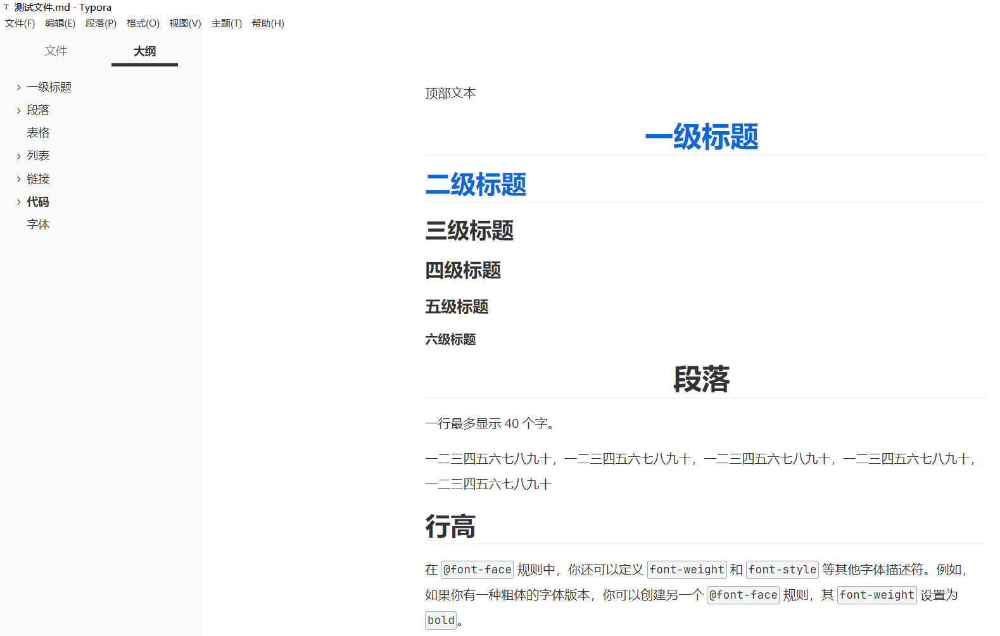

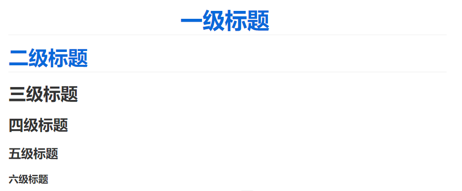


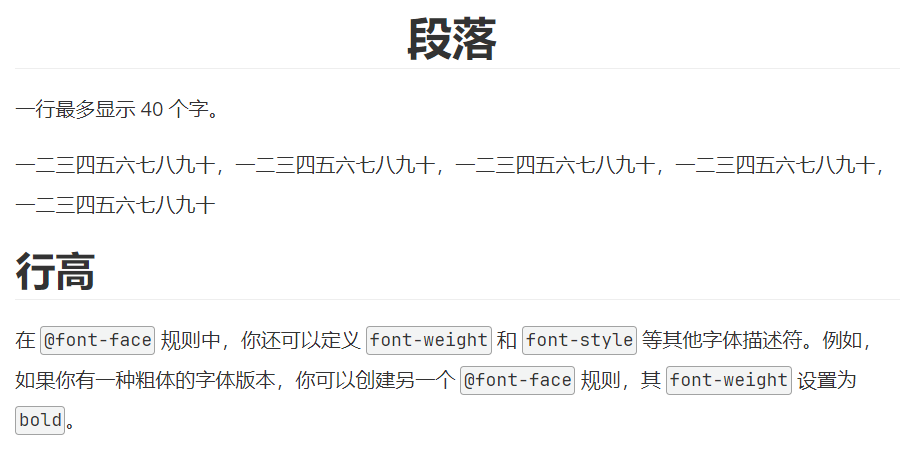

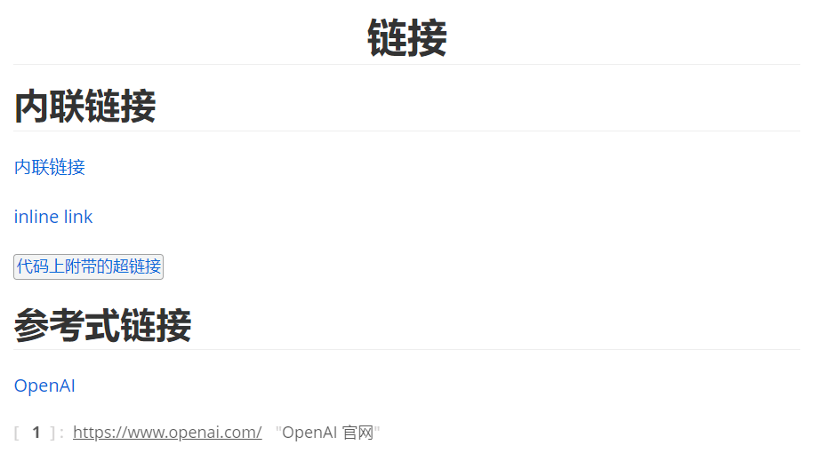

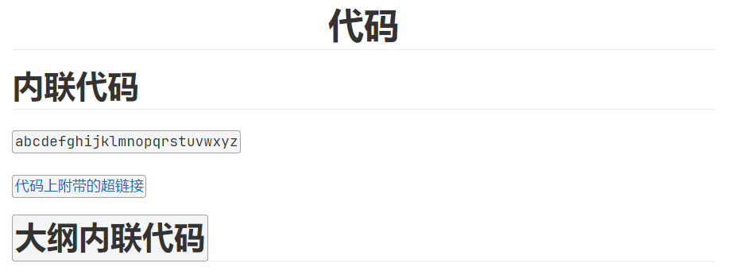

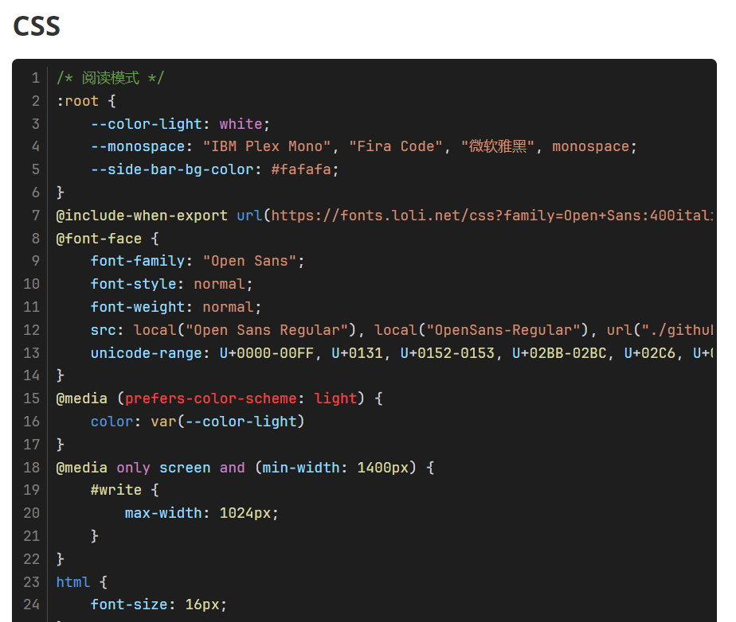

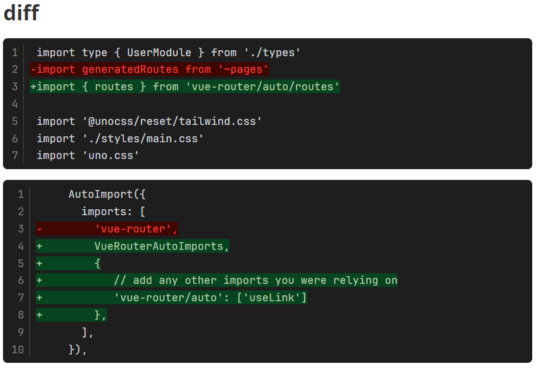

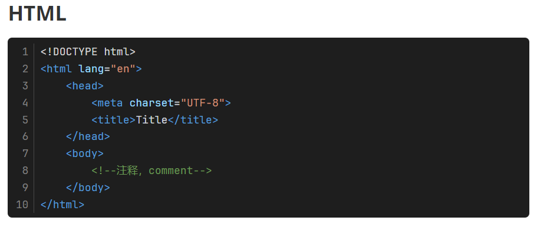

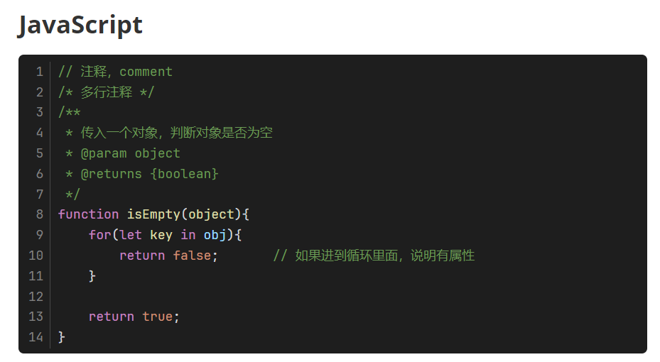

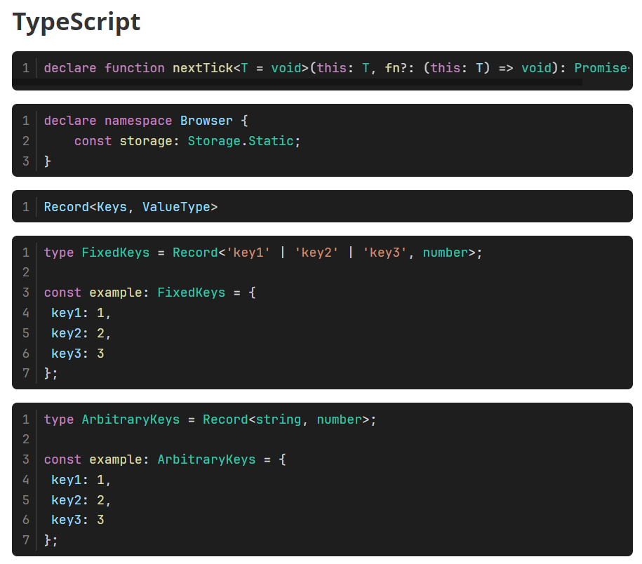

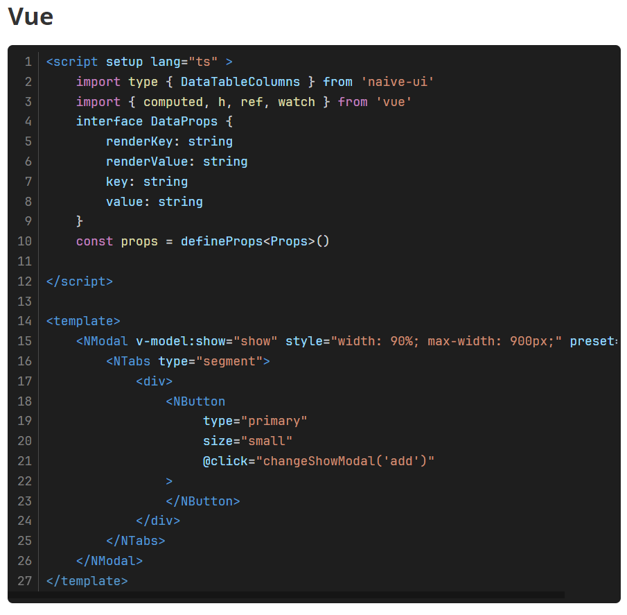

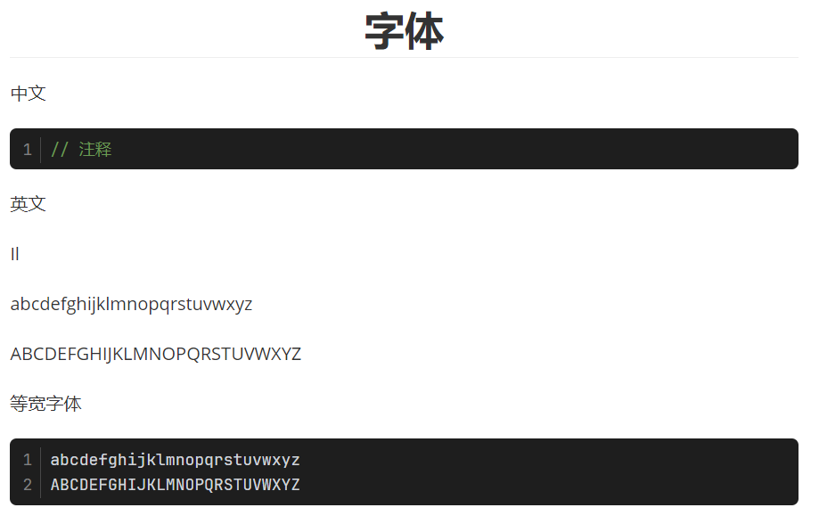

夜间模式

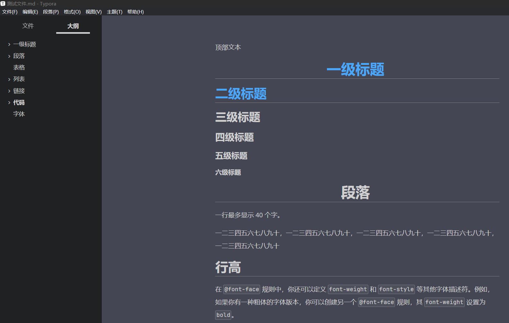

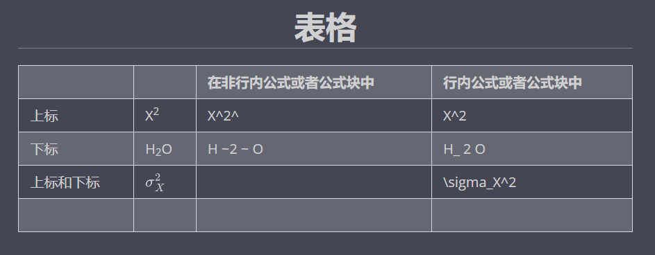

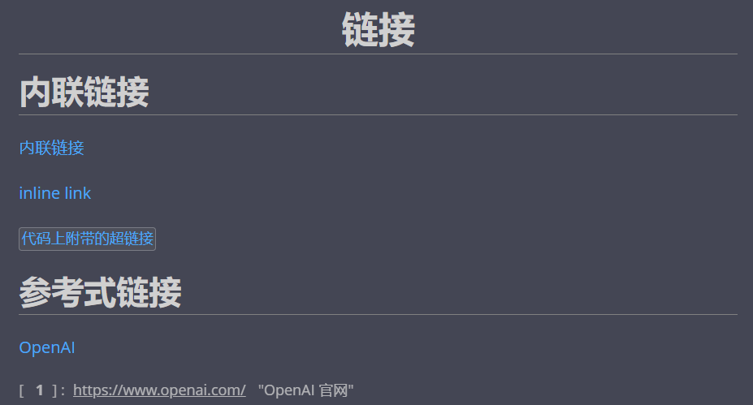

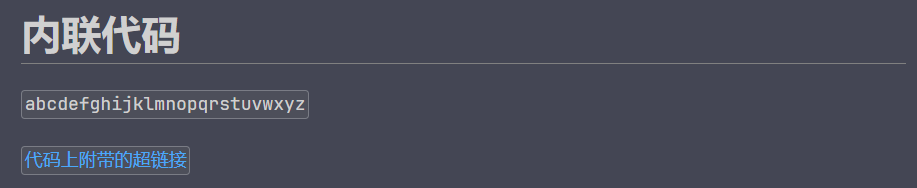

## 使用方法

本项目采用 SCSS 来预处理 CSS 。要想使用本主题需要将 SCSS 代码编译成 CSS 代码（直接使用 .scss 文件好像也行，不过部分样式好像会出问题）。

首先需要安装 [dart-sass](https://github.com/sass/dart-sass) 

克隆本项目到本地。

用 WebStorm 或 VSCode 打开本项目

在根目录下的终端中，运行以下命令中的一个即可

编译并监视：

```bash
sass --watch light-and-dark-lb.scss C:\Users\Administrator\AppData\Roaming\Typora\themes\light-and-dark-lb.css --no-source-map
```

编译并压缩代码：

```bash
sass light-and-dark-lb.scss C:\Users\Administrator\AppData\Roaming\Typora\themes\light-and-dark-lb.css --style=compressed --no-source-map
```

然后再设置中勾选 `在深色模式下使用独立的主题` ，浅色和深色主题都选择 `Light And Dark Lb` 主题

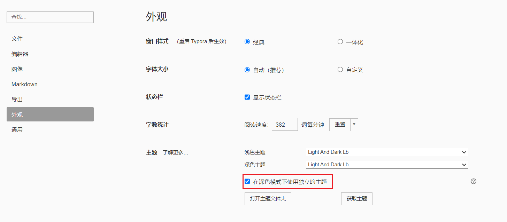

本项目提供了一个 [测试文件](测试文件.md) ，应用了 `Light And Dark Lb` 主题后，可查看相应的样式。

本项目有完备的注释，可自行修改成适合自己的主题。

## License

MIT
